# Arc42 Architecture Documentation: Next Wave

Version 1.0 | Date: November 2025

---

## 1. Introduction and Goals

### 1.1 Requirements Overview

Next Wave is an iOS app that helps wake surfers and foilers on Lake Zurich and other Swiss lakes catch their perfect wave. The app provides real-time boat schedules, smart notifications, and comprehensive weather information.

### 1.2 Quality Goals

| Priority | Quality Goal | Description |
|----------|--------------|-------------|
| 1 | Performance | Fast loading times through intelligent caching (< 2s for departures) |
| 2 | Reliability | High availability of schedule data through fallback mechanisms |
| 3 | Usability | Intuitive navigation with maximum 2 clicks to goal |
| 4 | Privacy | No data collection, all data stays on device |
| 5 | Offline Capability | Core functions available without internet connection |

### 1.3 Stakeholders

| Role | Contact | Expectations |
|------|---------|--------------|
| Wake Surfers & Foilers | Community | Reliable wave predictions, precise timing information |
| Developer | @pfederi | Maintainable, extensible codebase |
| App Store Users | Public | Stable app without crashes, regular updates |
| Shipping Companies | ZSG, etc. | Correct representation of schedules |

---

## 2. Architecture Constraints

### 2.1 Technical Constraints

| Constraint | Explanation |
|------------|-------------|
| iOS 16+ | Minimum version for SwiftUI features |
| watchOS 9+ | For Apple Watch companion app |
| Swift 5.9+ | Programming language |
| Xcode 15+ | Development environment |
| Vercel | Serverless functions for backend APIs |

### 2.2 Organizational Constraints

| Constraint | Explanation |
|------------|-------------|
| Open Source | MIT License, public GitHub repository |
| Solo Development | Main developer: Patrick Federi |
| Community-Driven | Feature requests from Pumpfoiling Community |

### 2.3 Conventions

- **Code Style**: Swift Standard Library Conventions
- **Branching**: Git Flow (main, develop, feature branches)
- **Documentation**: Inline comments for complex logic
- **Testing**: Manual testing before each release

---

## 3. Context and Scope

### 3.1 Business Context


### 3.2 Technical Context

**Incoming Interfaces:**

| Interface | Technology | Purpose |
|-----------|------------|---------|
| transport.opendata.ch | REST API | Real-time schedule data for Swiss ferries |
| OpenWeather API | REST API | Weather forecasts (temperature, wind, pressure) |
| Sunrise-Sunset.org | REST API | Sunrise/sunset times |
| Custom Vercel API | REST API | Ship assignments for Lake Zurich (web scraping) |
| MeteoNews API | REST API | Water temperature & water levels |
| OpenStreetMap | Tile Server | Map rendering |

**Outgoing Interfaces:**

| Interface | Technology | Purpose |
|-----------|------------|---------|
| UserNotifications | iOS Framework | Local push notifications |
| WidgetKit | iOS Framework | Home screen & lock screen widgets |
| WatchConnectivity | iOS Framework | Data synchronization with Apple Watch |
| CoreLocation | iOS Framework | GPS positioning |

---

## 4. Solution Strategy

### 4.1 Technology Decisions

| Decision | Rationale |
|----------|-----------|
| SwiftUI | Modern, declarative UI, cross-platform (iOS/watchOS) |
| Swift Concurrency (async/await) | Non-blocking API calls, better performance |
| MVVM Architecture | Clear separation of UI and business logic |
| App Groups | Data sharing between app, widgets, and watch |
| Vercel Serverless | Cost-effective backend solution for web scraping |

### 4.2 Architecture Patterns

**MVVM (Model-View-ViewModel)**
- **Models**: Data structures (Journey, Lake, Station, etc.)
- **Views**: SwiftUI Views (ContentView, DeparturesListView, etc.)
- **ViewModels**: Business logic (ScheduleViewModel, LakeStationsViewModel, etc.)

**Repository Pattern**
- API layer abstracts external data sources
- Caching strategies implemented in API services

### 4.3 Quality Assurance

- **Caching**: 24h cache for ship names, weather, and water temperature
- **Error Handling**: Graceful degradation on API failures
- **Offline Support**: Cached data remains available
- **Performance**: Parallel API calls with TaskGroups

---

## 5. Building Block View

### 5.1 Level 1: System Overview


### 5.2 Level 2: iOS App Components


### 5.3 Key Components

#### 5.3.1 ScheduleViewModel
**Responsibility**: Management of departure data and business logic

**Interfaces**:
- `loadDepartures(for station: Station, date: Date)` - Loads departures
- `refreshDepartures()` - Refreshes data
- `scheduleNotification(for departure: Journey)` - Schedules notification

**Dependencies**: TransportAPI, WeatherAPI, VesselAPI

#### 5.3.2 TransportAPI
**Responsibility**: Communication with transport.opendata.ch

**Interfaces**:
- `getStationboard(stationId: String, for date: Date) async throws -> [Journey]`

**Caching**: In-memory cache for queries

#### 5.3.3 VesselAPI
**Responsibility**: Fetching ship assignments

**Interfaces**:
- `getShipName(for courseNumber: String, date: Date) async -> String?`
- `preloadData() async` - Preloads data
- `clearCache()` - Manually clears all cached vessel data

**Caching**: 24h cache with date as key
- Manual cache clearing available via Settings > Data Management
- Useful for troubleshooting or forcing immediate updates

#### 5.3.4 AppSettings
**Responsibility**: User preferences and app configuration

**Settings**:
- `theme`: Light, dark, or system theme
- `showNearestStation`: Show nearest station on home screen
- `showWeatherInfo`: Display weather information
- `enableAlbisClassFilter`: Enable device flip gesture for Albis-Class filter (Zürichsee only)
- `useNearestStationForWidget`: Widget mode (nearest station vs favorites)

**Storage**: UserDefaults

#### 5.3.5 SharedDataManager
**Responsibility**: Data exchange between app, widgets, and watch

**Interfaces**:
- `saveNextDepartures(_ departures: [DepartureInfo])`
- `loadNextDepartures() -> [DepartureInfo]`
- `saveWidgetSettings(_ settings: WidgetSettings)`

**Storage**: UserDefaults with App Group container

---

## 6. Runtime View

### 6.1 Scenario: Loading Departures


### 6.2 Scenario: Widget Update


### 6.3 Scenario: Loading Ship Names (with Caching)


---

### 6.4 Scenario: Loading Weather Data


---

### 6.5 Scenario: Loading Sun Times and Daylight Phase Icons

```mermaid
sequenceDiagram
    participant ViewModel
    participant SunTimeService
    participant Cache as UserDefaults Cache
    participant SunAPI as Sunrise-Sunset.org API
    participant DepartureView
    
    ViewModel->>SunTimeService: getSunTimes(date)
    SunTimeService->>Cache: Check Cache (24h validity)
    
    alt Cache Valid
        Cache-->>SunTimeService: Sun Times Data
    else Cache Expired/Missing
        SunTimeService->>SunAPI: HTTP GET /json?lat=...&lng=...&date=...
        SunAPI-->>SunTimeService: Sun Times (JSON)<br/>• Sunrise<br/>• Sunset<br/>• Civil Twilight Begin<br/>• Civil Twilight End
        SunTimeService->>Cache: Store in Cache (24h)
    end
    
    SunTimeService-->>ViewModel: Sun Times
    ViewModel->>ViewModel: Store sunTimes in @Published property
    
    DepartureView->>DepartureView: For each departure:<br/>getDaylightPhaseIcon(departureTime)
    DepartureView->>DepartureView: Compare departure time with:<br/>• Sunrise/Sunset<br/>• Civil Twilight times
    
    alt Full Daylight (After Sunrise, Before Sunset)
        DepartureView->>DepartureView: Show sun.max.fill icon (☀️)
    else During Twilight Period
        alt Morning Twilight (Before Sunrise)
            DepartureView->>DepartureView: Show sunrise.fill icon (🌅)
        else Evening Twilight (After Sunset)
            DepartureView->>DepartureView: Show sunset.fill icon (🌅)
        end
    else Full Darkness
        DepartureView->>DepartureView: Show moon.fill icon (🌙)
    end
```



**Key Features:**
- Visual daylight phase indicators for all departures
- Three distinct phases: Sun (daylight), Twilight (dawn/dusk), Moon (night)
- Instant session planning with quick visual feedback
- Uses local sunrise/sunset times for station location
- Icons displayed consistently across departure list, favorites, and search
- Graceful degradation if API unavailable (no icon shown)
- Cached data prevents excessive API calls

---

### 6.6 Scenario: Watch Connectivity Sync


---

### 6.7 Scenario: Notification Scheduling


---

### 6.8 Scenario: Finding Nearest Station


---

### 6.9 Scenario: Wave Analytics Calculation


---

### 6.10 Scenario: Background Widget Data Refresh


---

### 6.11 Scenario: Device Flip Gesture (Theme Toggle)

```mermaid
sequenceDiagram
    actor User
    participant Device as Device Motion
    participant ShakeDetector
    participant AppSettings
    participant UI
    
    User->>Device: Flip device 180°
    Device->>ShakeDetector: Motion update
    ShakeDetector->>ShakeDetector: Detect roll rotation
    ShakeDetector->>ShakeDetector: Check cooldown (3s)
    
    alt In Departure View
        ShakeDetector->>ViewModel: Toggle Albis filter
        ViewModel->>ViewModel: Filter departures
        ViewModel->>UI: Update departure list
        ShakeDetector->>Device: Haptic feedback (notification)
    else In Other Views
        ShakeDetector->>AppSettings: Toggle theme
        AppSettings->>AppSettings: Switch light/dark mode
        AppSettings->>UI: Apply new theme
        ShakeDetector->>Device: Haptic feedback (impact)
    end
```



---

### 6.12 Scenario: Share Wave with Friends

```mermaid
sequenceDiagram
    actor User
    participant DepartureView
    participant ShareGenerator
    participant ShareSheet
    participant WhatsApp
    participant Messages as Messages (MFMessageComposer)
    participant Mail
    
    User->>DepartureView: Tap share button (only for future departures)
    DepartureView->>ShareGenerator: Generate share content
    ShareGenerator->>ShareGenerator: Select random intro message (5 variations)
    ShareGenerator->>ShareGenerator: Format departure details<br/>• Station name<br/>• Date & Time<br/>• Route & Ship name<br/>• Weather (temp, wind, wetsuit)<br/>• Water level<br/>• App Store link
    ShareGenerator-->>DepartureView: Share text ready
    DepartureView->>ShareSheet: Show custom share sheet
    ShareSheet-->>User: Display options:<br/>WhatsApp | Messages | Mail
    
    alt User selects WhatsApp
        User->>ShareSheet: Tap WhatsApp button
        ShareSheet->>ShareSheet: Check if WhatsApp installed
        ShareSheet->>WhatsApp: Open via URL scheme<br/>whatsapp://send?text=...
        WhatsApp->>WhatsApp: Pre-fill message with text
        WhatsApp-->>User: Ready to send
        User->>WhatsApp: Select contacts & send
    else User selects Messages
        User->>ShareSheet: Tap Messages button
        ShareSheet->>Messages: Present MFMessageComposer
        Messages->>Messages: Pre-fill body with full text<br/>(supports emojis & formatting)
        Messages-->>User: Native message composer
        User->>Messages: Select recipients
        User->>Messages: Send message
        Messages-->>ShareSheet: Dismiss
    else User selects Mail
        User->>ShareSheet: Tap Mail button
        ShareSheet->>Mail: Open via URL scheme<br/>mailto:?subject=...&body=...
        Mail->>Mail: Pre-fill subject: "Next Wave 🌊"
        Mail->>Mail: Pre-fill body with text<br/>(URL encoded, emoji support)
        Mail-->>User: Mail composer
        User->>Mail: Add recipients
        User->>Mail: Send email
    end
    
    ShareSheet->>DepartureView: Dismiss sheet
    DepartureView-->>User: Return to departure list
```



---

### 6.13 Scenario: Water Temperature & Level Loading


---

### 6.14 Scenario: Map Interaction


---

### 6.15 Scenario: Schedule Period Detection


---

### 6.16 Scenario: First Launch Safety Rules

```mermaid
sequenceDiagram
    actor User
    participant App
    participant UserDefaults
    participant SafetyModal
    
    User->>App: Launch app for first time
    App->>UserDefaults: Check "hasShownNavigationRules"
    UserDefaults-->>App: false (first launch)
    
    App->>App: Delay 0.5s (view loaded)
    App->>SafetyModal: Show modal
    SafetyModal-->>User: Display safety rules<br/>• 50-meter rule<br/>• Priority vessels<br/>• Equipment requirements<br/>• Swiss Pumpfoilers Code
    
    User->>SafetyModal: Read & dismiss
    SafetyModal->>UserDefaults: Set "hasShownNavigationRules" = true
    SafetyModal->>App: Close modal
    App-->>User: Show main interface
    
    Note over App,UserDefaults: Modal won't show again<br/>but accessible via settings
```



---

### 6.17 Scenario: Error Handling & Graceful Degradation


---

### 6.18 Scenario: Parallel Data Loading on App Start

```mermaid
sequenceDiagram
    participant App
    participant WeatherAPI
    participant WaterTempAPI
    participant VesselAPI
    participant FavoritesManager
    
    App->>App: App launches
    
    par Parallel Preloading
        App->>WeatherAPI: preloadData()
        WeatherAPI->>WeatherAPI: Load weather for favorites
        WeatherAPI-->>App: Ready
    and
        App->>WaterTempAPI: preloadData()
        WaterTempAPI->>WaterTempAPI: Load all lake temperatures
        WaterTempAPI-->>App: Ready
    and
        App->>VesselAPI: preloadData()
        VesselAPI->>VesselAPI: Load ship assignments
        VesselAPI-->>App: Ready
    and
        App->>FavoritesManager: loadDepartureDataForWidgets()
        FavoritesManager->>FavoritesManager: Load departures for widgets
        FavoritesManager-->>App: Ready
    end
    
    Note over App: All data loaded in parallel<br/>for optimal performance
    App->>App: Show UI with preloaded data
```

---

## 7. Deployment View

### 7.1 Infrastructure

```mermaid
graph TB
    subgraph Devices["User Devices"]
        iPhone["iPhone<br/>iOS 16+"]
        Watch["Apple Watch<br/>watchOS 9+"]
        iPad["iPad<br/>iOS 16+"]
    end
    
    subgraph Cloud["Internet / Cloud"]
        subgraph Vercel["Vercel Serverless"]
            Ships["/api/ships<br/>Node.js + Puppeteer"]
            WaterTemp["/api/water-temperature<br/>Node.js"]
        end
        
        subgraph External["External APIs"]
            Transport["transport.opendata.ch"]
            Weather["OpenWeather"]
            Sun["Sunrise-Sunset.org"]
            Meteo["MeteoNews"]
            OSM["OpenStreetMap"]
        end
    end
    
    iPhone -->|HTTPS| Vercel
    iPhone -->|HTTPS| External
    Watch -->|HTTPS| Vercel
    Watch -->|HTTPS| External
    iPad -->|HTTPS| Vercel
    iPad -->|HTTPS| External
    
    style Devices fill:#e3f2fd
    style Vercel fill:#fff3e0
    style External fill:#f3e5f5
```

### 7.2 Deployment

**iOS App**:
- Distribution via Apple App Store
- TestFlight for beta testing
- Xcode Cloud for CI/CD (optional)

**Backend APIs**:
- Vercel for serverless functions
- Automatic deployment via Git push
- Edge caching for performance

---

## 8. Cross-Cutting Concepts

### 8.1 Caching Strategy

| Data Type | Cache Duration | Storage Location | Invalidation |
|-----------|----------------|------------------|--------------|
| Departures | In-Memory | ViewModel | On refresh |
| Ship Names | 24h | UserDefaults | Midnight / Manual |
| Weather Data | 6h | In-Memory | Time-based |
| Sun Times | 24h | UserDefaults | Midnight |
| Water Temperature | 24h | UserDefaults | Midnight |
| Map Tiles | Unlimited | Disk Cache | Manual |

**Note**: Ship Names cache can be manually cleared via Settings > Data Management > Clear Ship Data Cache

### 8.2 Error Handling

**Strategy**: Graceful Degradation
- API errors are logged but not shown to user
- Fallback to cached data
- Empty states with helpful messages

**Example**:
```swift
do {
    let journeys = try await TransportAPI().getStationboard(...)
} catch {
    Logger.shared.error("Failed to load departures: \(error)")
    // Fallback to cached data or empty list
}
```

### 8.3 Logging

**Logger Component**:
- Central logging class for structured logs
- Log levels: Debug, Info, Warning, Error
- Output to Xcode console
- No logs in production (DEBUG flag only)

### 8.4 Privacy

**Privacy by Design**:
- No tracking SDKs
- No analytics
- Location data processed locally only
- No data transmission to third parties (except APIs)
- All user data in App Groups (local)

### 8.5 Localization

**Current**: English only
**Planned**: German, French, Italian

### 8.6 Accessibility

- VoiceOver support
- Dynamic Type for font sizes
- High-contrast colors
- Haptic feedback for important actions

---

## 9. Architecture Decisions

### 9.1 ADR-001: MVVM instead of MVC

**Status**: Accepted

**Context**: SwiftUI favors reactive programming

**Decision**: MVVM with @Published properties and Combine

**Rationale**:
- Better testability
- Clear separation of UI and logic
- SwiftUI-native data binding

**Consequences**:
- More boilerplate code
- Steeper learning curve for new developers

### 9.2 ADR-002: Vercel for Backend instead of Own Server

**Status**: Accepted

**Context**: Web scraping for ship assignments necessary

**Decision**: Vercel Serverless Functions with Puppeteer

**Rationale**:
- Free for small projects
- Automatic scaling
- Simple deployment
- Integrated caching

**Consequences**:
- Vendor lock-in
- Cold start latency
- Limited execution time (10s)

### 9.3 ADR-003: App Groups for Data Sharing

**Status**: Accepted

**Context**: Widgets and Watch app need access to departure data

**Decision**: Shared UserDefaults via App Groups

**Rationale**:
- Native iOS solution
- Simple API
- No additional dependencies

**Consequences**:
- Data size limited (few MB)
- No real-time synchronization
- Manual serialization required

### 9.4 ADR-004: 24h Cache for External Data

**Status**: Accepted

**Context**: API limits and performance optimization

**Decision**: Aggressive caching strategy with 24h validity

**Rationale**:
- Reduces API calls by 95%
- Improves app startup time
- Enables offline capability

**Consequences**:
- Data can be up to 24h old
- More complex cache invalidation
- Higher storage requirements

---

## 10. Quality Requirements

### 10.1 Quality Tree

```mermaid
graph TB
    Quality["Quality"]
    
    Quality --> Performance
    Quality --> Reliability
    Quality --> Usability
    Quality --> Maintainability
    Quality --> Security
    
    Performance --> P1["App start < 2s"]
    Performance --> P2["Load departures < 1s"]
    Performance --> P3["Widget update < 500ms"]
    
    Reliability --> R1["Availability > 99%"]
    Reliability --> R2["Fault tolerance<br/>(graceful degradation)"]
    Reliability --> R3["Data integrity"]
    
    Usability --> U1["Intuitive navigation"]
    Usability --> U2["Clear error messages"]
    Usability --> U3["Accessibility"]
    
    Maintainability --> M1["Modular architecture"]
    Maintainability --> M2["Code documentation"]
    Maintainability --> M3["Testability"]
    
    Security --> S1["Privacy (no tracking)"]
    Security --> S2["HTTPS for all APIs"]
    Security --> S3["Secure data storage"]
    
    style Quality fill:#e1f5ff
    style Performance fill:#fff3e0
    style Reliability fill:#f3e5f5
    style Usability fill:#e8f5e9
    style Maintainability fill:#fce4ec
    style Security fill:#ffebee
```

### 10.2 Quality Scenarios

| ID | Scenario | Quality Attribute | Priority |
|----|----------|-------------------|----------|
| QS-1 | User opens app → Departures displayed in < 1s | Performance | High |
| QS-2 | API unreachable → App shows cached data | Reliability | High |
| QS-3 | User activates VoiceOver → All elements are readable | Accessibility | Medium |
| QS-4 | Developer adds new lake → < 30min effort | Maintainability | Medium |
| QS-5 | User flips device → Theme switches immediately | Usability | Low |

---

## 11. Risks and Technical Debt

### 11.1 Risks

| ID | Risk | Probability | Impact | Mitigation |
|----|------|-------------|--------|------------|
| R-1 | transport.opendata.ch API changes | Medium | High | Monitoring, fallback logic |
| R-2 | ZSG changes website structure | High | Medium | Flexible scraping, error handling |
| R-3 | Apple changes WidgetKit API | Low | High | Regular updates, beta testing |
| R-4 | Vercel free tier limits | Low | Medium | Monitoring, upgrade plan |
| R-5 | Poor performance with many favorites | Medium | Low | Pagination, lazy loading |

### 11.2 Technical Debt

| ID | Description | Priority | Effort |
|----|-------------|----------|--------|
| TD-1 | Missing unit tests for ViewModels | High | 2 weeks |
| TD-2 | No localization (English only) | Medium | 1 week |
| TD-3 | Hardcoded ship ratings | Low | 2 days |
| TD-4 | No CI/CD pipeline | Medium | 3 days |
| TD-5 | Outdated dependencies | Low | 1 day |

---

## 12. Glossary

| Term | Definition |
|------|------------|
| Wakethieving | Sport of surfing on waves created by boats |
| Foiling | Surfing on a hydrofoil board |
| ZSG | Zürichsee-Schifffahrtsgesellschaft (Lake Zurich Shipping Company) |
| Albis-Class | Large ships that create particularly good waves |
| UIC-Ref | Unique station identifier in Swiss transport system |
| Stationboard | Schedule board showing departures |
| Wave Rating | Quality rating of waves (1-3 waves) |
| Session | Surf session with multiple waves |
| Nearest Station | Closest ferry station based on GPS |
| Widget Timeline | Schedule for widget updates |
| App Groups | iOS mechanism for data sharing between apps |
| Serverless Function | Cloud function without own server (Vercel) |
| Puppeteer | Headless browser for web scraping |
| Graceful Degradation | Fault-tolerant behavior with reduced functionality |

---

## Appendix

### A.1 Frameworks and Libraries Used

**iOS/Swift**:
- SwiftUI (UI Framework)
- Combine (Reactive Programming)
- CoreLocation (GPS)
- CoreMotion (Device Motion)
- MapKit (Maps)
- WidgetKit (Widgets)
- WatchConnectivity (Watch Sync)
- UserNotifications (Notifications)

**Backend (Node.js)**:
- @vercel/node (Serverless Runtime)
- puppeteer-core (Web Scraping)
- @sparticuz/chromium (Headless Browser)
- cheerio (HTML Parsing)
- axios (HTTP Client)

### A.2 External APIs

| API | Purpose | Documentation |
|-----|---------|---------------|
| transport.opendata.ch | Schedule data | https://transport.opendata.ch |
| OpenWeather | Weather data | https://openweathermap.org/api |
| Sunrise-Sunset.org | Sun times | https://sunrise-sunset.org/api |
| MeteoNews | Water temperature | https://meteonews.ch |
| OpenStreetMap | Map data | https://www.openstreetmap.org |

### A.3 Project Structure

```
Next Wave/
├── Next Wave/                    # iOS App
│   ├── API/                      # API Layer
│   ├── Models/                   # Data Models
│   ├── ViewModels/               # Business Logic
│   ├── Views/                    # SwiftUI Views
│   ├── Utilities/                # Helper Classes
│   └── Data/                     # Static Data (JSON)
├── Next Wave Watch Watch App/    # watchOS App
├── NextWaveWidget/               # iOS Widgets
├── NextWaveWatchWidgetExtension/ # watchOS Widgets
├── api/                          # Vercel Serverless Functions
│   ├── ships.ts                  # Ship Assignments
│   └── water-temperature.ts      # Water Temperature
├── scripts/                      # Python Scripts
└── Shared/                       # Shared Data
```

### A.4 Deployment Process

**iOS App**:
1. Code changes in feature branch
2. Pull request + code review
3. Merge to `develop`
4. Testing on TestFlight
5. Generate App Store screenshots with Fastlane: `fastlane screenshots`
6. Release to `main` branch
7. App Store submission

**Backend APIs**:
1. Code changes in Git
2. Push to GitHub
3. Automatic deployment via Vercel
4. Edge caching enabled

### A.5 Automated Screenshot Generation

**Fastlane Snapshot**:
- Automated screenshot generation for App Store
- Supports multiple device sizes (iPhone 17 Pro Max, iPhone 17 Pro, iPhone 16e, iPad Pro 13-inch M4)
- Status bar customization (9:41 AM, full battery)
- Optional device frames with Frameit

**Configuration**:
- `fastlane/Snapfile`: Device and language configuration
- `fastlane/Fastfile`: Automation lanes
- `Next WaveUITests/Next_WaveUITestsLaunchTests.swift`: Screenshot capture logic

**Commands**:
```bash
fastlane screenshots              # Generate screenshots
fastlane add_frames               # Add device frames
fastlane generate_all_screenshots # Both combined
```

### A.6 Contact and Resources

- **GitHub**: https://github.com/pfederi/Next-Wave
- **App Store**: https://apps.apple.com/ch/app/next-wave/id6739363035
- **Community**: https://pumpfoiling.community
- **Maintainer**: @pfederi (Patrick Federi)

---

**Document Version**: 1.0  
**Last Updated**: November 2025  
**Author**: Patrick Federi  
**Status**: Living Document

