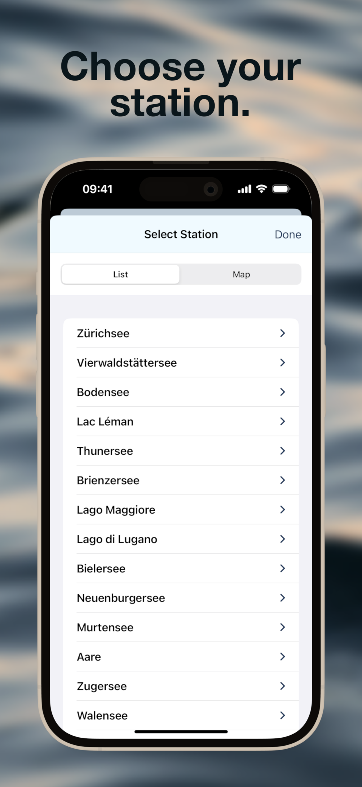
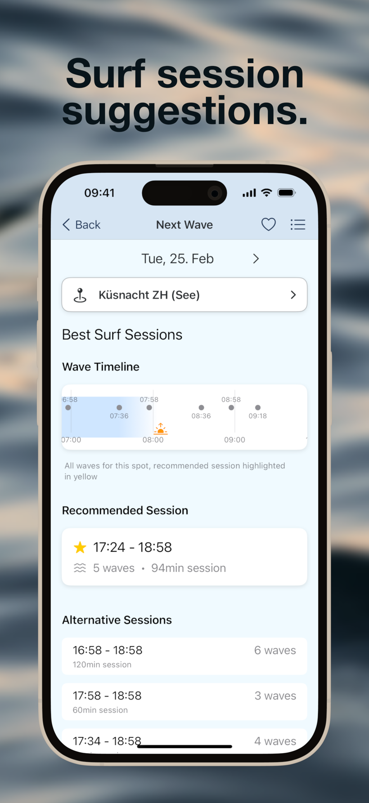
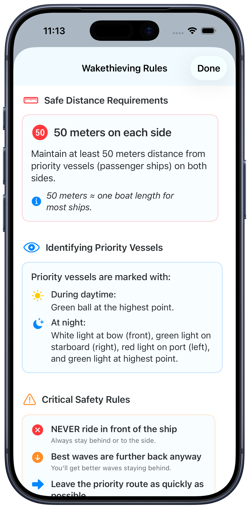

# Next Wave

Next Wave is an iOS app that helps wake surfers and foilers catch their perfect wave on Lake Zurich by providing real-time boat schedules and smart notifications.




<a href="https://apps.apple.com/ch/app/next-wave/id6739363035">
    
</a>

## Features

- 🌊 Real-time boat schedule tracking
- 🔔 Smart notifications 3,5,10 or 15 minutes before waves
- 📍 Easy spot selection on Swiss lakes
- 🆕 Store up to 5 favorite stations
- 🆕 Nearby station is displayed
- 🆕 New Analytics View with session recommendations, wave timeline, best session detection and wave frequency analysis
- 🆕 Daylight Integration with sunrise, sunset, twilight phase visualization, smart session planning based on daylight and beautiful gradient visualization
- 🎯️ Interactive map with OpenStreetMap integration
- 🎯 Precise wave timing information
- 🔊 Custom sound notifications
- 🎨 Clean, intuitive interface
- 📱 Light & Dark Mode

## Map Features

- OpenStreetMap integration for detailed water navigation
- Shipping routes overlay for better orientation
- Station clustering for better overview
- Automatic map caching for offline use
- Optimized for both light and dark mode

## Installation

1. Clone the repository
2. Open `Next Wave.xcodeproj` in Xcode
3. Build and run the project

## Privacy

- No tracking or analytics
- No personal data collection
- All data stays on device
- Location data is only used to show nearest station and your position on the map and is never stored or shared
- Location access can be denied without losing core app functionality

## Location Permission

The app requests location access to:
- Show your position on the map
- Enable the location tracking button
- Show nearest station

You can use the app without granting location access. In this case:
- Your position won't be shown on the map
- The location tracking button will be disabled
- The nearest station will not be shown

## Support

For questions or issues, please create an issue in the repository.


## How to add a new lake or station

### Data Structure

The app uses a JSON schedule file with the following structure. Note that coordinates are required for map display:

```
{
    "lakes": [
        {
            "name": "Lake",
            "operators": [
                "Operator"
            ],
            "stations": [
                {
                    "name": "Station Name",
                    "uic_ref": "8503651",
                    "coordinates": {
                        "latitude": 47.218035,
                        "longitude": 8.776638
                    }
                },
                {
                    "name": "Station Name",
                    "uic_ref": "8503682",
                    "coordinates": {
                        "latitude": 47.218035,
                        "longitude": 8.776638
                    }
                }
            ]
        },
    ]
}
```

To find the name and especially the station ID, use the tool https://overpass-turbo.eu/
Search for the lake on the map on the right and make it completely visible. enter the following query in the console on the left:

```
node
  [amenity=ferry_terminal]
  ({{bbox}});
out;
```

All ship stations are displayed. Clicking on the station opens a window where you can find the station ID, the name of the station and the coordinates. uic_name and uic_ref. These values are entered in the JSON file.

You can check whether the station is available in the API via https://transport.opendata.ch/v1/locations?query=[uic_ref].
The link above is for Switzerland. For other countries, you have to find another api to find departure times.

### Technical Details

### Ship Data and Wave Calculation

The app uses various systems for collecting ship data and calculating wave characteristics:

#### 1. Vessel Data Scraper and Wave Calculation (`scripts/vesseldata.py`)
- Automatically extracts technical data of all ZSG ships
- Collects information like length, width, displacement etc.
- Calculates based on technical data:
  - Maximum wave height (m): `H = 0.04 * D * v² / (L * B)`
  - Wave length (m): `λ = 2π * v² / g`
  - Wave period (s): `T = √(2π * λ / g)`
  - Wave velocity (m/s): `c = λ / T`
  - Wave energy (J/m²): `E = (1/8) * ρ * g * H²`
  - Wave power (W/m): `P = E * c`
  - Impact force (N/m²): `F = ρ * g * H * (c²/2)`

Where:
- D = Displacement [t]
- v = Velocity [m/s]
- L = Length [m]
- B = Beam width [m]
- g = Gravitational acceleration (9.81 m/s²)
- ρ = Water density (1000 kg/m³)
- H = Wave height [m]
- λ = Wave length [m]
- T = Wave period [s]
- c = Wave velocity [m/s]

Additional factors:
- Froude length number: `Fr_L = v / √(g * L)`
- Froude depth number: `Fr_h = v / √(g * h)`
- Reynolds number: `Re = (L * v) / ν`
  - ν = Kinematic viscosity (1.0e-6 m²/s)

The calculations consider:
- Ship length and width
- Displacement
- Speed (18 km/h)
- Water depth (10m default)
- Froude and Reynolds numbers

##### Wave Rating Calculation:

1. **Input Data** for each ship:
   - Technical data from scraper (length, width, displacement)
   - Constant values:
     - Speed: 18 km/h (5 m/s)
     - Water depth: 10m
     - Water density: 1000 kg/m³

2. **Calculation Steps**:
   a) Calculate maximum wave height (H)
   b) Derive wave energy (E) and impact force (F)
   c) Compare with thresholds:
      - Energy: <150 J/m² → 1 wave, 150-250 J/m² → 2 waves, >250 J/m² → 3 waves
      - Force: <45000 N/m² → 1 wave, 45000-55000 N/m² → 2 waves, >55000 N/m² → 3 waves
   d) Final rating is the higher of both values

3. **Example Calculation MS Panta Rhei**:
   - Length: 56.6m, Width: 10.7m, Displacement: 382t
   - Wave height: H = 0.63m
   - Wave energy: E = 488 J/m² → 3 waves
   - Impact force: F = 77347 N/m² → 3 waves
   - Result: 3 waves

4. **Example Calculation MS Bachtel**:
   - Length: 33.3m, Width: 6.3m, Displacement: 64t
   - Wave height: H = 0.31m
   - Wave energy: E = 114 J/m² → 1 wave
   - Impact force: F = 37409 N/m² → 1 wave
   - Result: 1 wave

##### Wave Rating (1-3 waves):
- **Strong waves (3)**: MS Panta Rhei, MS Albis
  - High wave energy (>250 J/m²)
  - High impact force (>55000 N/m²)
  
- **Medium waves (2)**: MS Wädenswil, MS Limmat, MS Helvetia, MS Linth
  - Medium wave energy (150-250 J/m²)
  - Medium impact force (45000-55000 N/m²)
  
- **Light waves (1)**: MS Bachtel, DS Stadt Rapperswil, DS Stadt Zürich, MS Säntis
  - Low wave energy (<150 J/m²)
  - Low impact force (<45000 N/m²)

Execution: `python3 scripts/vesseldata.py`
Saves data to `schiffsdaten.csv`

#### 2. Vessel API (`api/ships.ts`)
- Vercel-based API for real-time ship deployments
- Provides current ship-course assignments
- Currently only available for Lake Zurich
- Endpoint: `/api/ships`
- Cache system for optimal performance
- Automatic updates every 15 minutes
- Nightly verification of ship deployments for the next day

# Feature Ideas Welcome

Have an idea for improving Next Wave? We're always open to suggestions from the community! Whether it's new features, usability improvements, or support for additional lakes - we'd love to hear from you. Feel free to open an issue on GitHub to discuss your ideas or contribute directly through a pull request.

Some ideas that have been suggested:
- Link to Foil Mates and vice versa for nearby spots

Note: International support is currently out of scope for this project. Feel free to fork the repository and create a version for your specific country!

## Maintainers

[@pfederi](https://github.com/pfederi).

## Contributing

Contributions are welcome! Please feel free to submit a Pull Request.
Kanban Board is here: https://github.com/users/pfederi/projects/1

## License

This project is licensed under the MIT License - see the LICENSE file for details.

## Contact

Join our community: [Pumpfoiling Community](https://pumpfoiling.community)

## Safety Notice

Always maintain a safe distance from boats and follow local water safety regulations. Never surf directly behind vessels.

## Acknowledgments

- Thanks to all beta testers
- Special thanks to Alex for all your good ideas and testing
- Special thanks to Nils Mango for the favorite and nearby station feature requests
- Map data © OpenStreetMap contributors
- Special thanks to the Lake boat operators - We would be delighted if you step on the gas a little more while departing from the dock.
