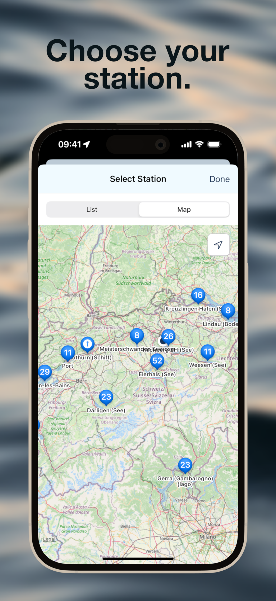
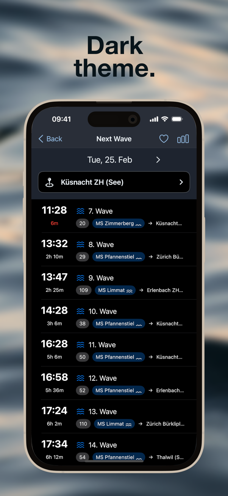

# Next Wave

Next Wave is an iOS app that helps wake surfers and foilers catch their perfect wave on Lake Zurich by providing real-time boat schedules and smart notifications.




<a href="https://apps.apple.com/ch/app/next-wave/id6739363035">
    
</a>

## 📚 Documentation

- **[Arc42 Architecture Documentation](ARC42_DOCUMENTATION.md)** - Complete architecture documentation with diagrams and technical details
- **[User Stories & Acceptance Criteria](USER_STORIES.md)** - All 47 user stories with acceptance criteria and release planning
- **[API Documentation](API_DOCUMENTATION.md)** - Backend API endpoints and integration details

## Table of Contents

- [Quick Start](#quick-start)
- [Features Overview](#features-overview)
- [Installation](#installation)
- [Usage](#usage)
- [Privacy](#privacy)
- [Contributing](#contributing)
- [Support](#support)
- [License](#license)

## Quick Start

1. **Download**: Get Next Wave from the [App Store](https://apps.apple.com/ch/app/next-wave/id6739363035)
2. **Add Favorites**: Select up to 5 favorite ferry stations
3. **Get Notifications**: Set alerts 3, 5, 10, or 15 minutes before waves
4. **Catch Waves**: Head to the water at the perfect time! 🌊

For detailed technical documentation, see [Arc42 Documentation](ARC42_DOCUMENTATION.md).

## Features Overview

### Core Features
- 🌊 **Real-time boat schedules** for Swiss lakes
- 🔔 **Smart notifications** (3, 5, 10, or 15 minutes before waves)
- ⭐ **Favorite stations** (up to 5)
- 📍 **Nearest station detection** with GPS
- ⌚️ **Apple Watch app** with complications and widgets

### Wave Intelligence
- 🚢 **Ship names & wave ratings** (1-3 waves) for Lake Zurich
- 📊 **Wave analytics** with best session recommendations
- 🌅 **Daylight phase icons** (sun/twilight/moon) for each departure
- ☀️ **Daylight integration** for optimal session planning
- 🔍 **Albis-Class filter** for best waves

### Weather & Conditions
- 🌤️ **Real-time weather** (temperature, wind, pressure)
- 🌡️ **Water temperature** for all Swiss lakes
- 💧 **Water level** indicators
- 🤸 **Wetsuit recommendations** based on conditions

### User Experience
- 🗺️ **Interactive map** with OpenStreetMap
- 📱 **Light & Dark Mode** with device flip gesture
- 📤 **Share waves** via WhatsApp, Messages, or Mail
- 🛡️ **Safety guidelines** integrated
- 💬 **Fun messages** with personality

For complete feature details and technical specifications, see the [Arc42 Documentation](ARC42_DOCUMENTATION.md).

## Installation

### For Users
1. Download from the [App Store](https://apps.apple.com/ch/app/next-wave/id6739363035)
2. Grant location permissions (optional, for nearest station feature)
3. Grant notification permissions (optional, for wave alerts)
4. Add your favorite stations
5. Start catching waves! 🌊

### For Developers
1. Clone the repository
   ```bash
   git clone https://github.com/pfederi/Next-Wave.git
   ```
2. Open `Next Wave.xcodeproj` in Xcode
3. Create a `Config.swift` file with your API keys:
   ```swift
   struct Config {
       static let openWeatherApiKey = "YOUR_API_KEY"
   }
   ```
4. Build and run the project

For detailed architecture and technical information, see the [Arc42 Documentation](ARC42_DOCUMENTATION.md).

## Usage

### Basic Usage
1. **Select a Station**: Choose from favorites or browse all Swiss lakes
2. **View Departures**: See upcoming boat departures with ship names and wave ratings
3. **Check Weather**: View temperature, wind, and wetsuit recommendations
4. **Set Notifications**: Tap the bell icon to get alerted before waves arrive
5. **Analyze Sessions**: Use the analytics view to find the best surf sessions

### Advanced Features
- **Nearest Station**: Enable in settings to automatically show closest station
- **Albis Filter**: Flip device in departure view to show only best waves
- **Share Waves**: Tap share button to invite friends via WhatsApp, Messages, or Mail
- **Apple Watch**: Install watch app for wrist-based departure times

For detailed usage scenarios and workflows, see the [Arc42 Documentation - Runtime View](ARC42_DOCUMENTATION.md#6-runtime-view).

## Privacy

- No tracking or analytics
- No personal data collection
- All data stays on device
- Location data is only used to show nearest station and your position on the map and is never stored or shared
- Location access can be denied without losing core app functionality

## Data Sources & Attribution

Next Wave aggregates data from various public sources:

- **Ferry Schedules**: [transport.opendata.ch](https://transport.opendata.ch) - Swiss public transport API
- **Ship Assignments**: [ZSG (Zürichsee-Schifffahrtsgesellschaft)](https://einsatzderschiffe.zsg.ch) - Lake Zurich ship deployment data
- **Water Temperature & Levels**: [MeteoNews](https://meteonews.ch) - Swiss lake water data
- **Weather Data**: [OpenWeather](https://openweathermap.org) - Weather forecasts and conditions
- **Sun Times**: [Sunrise-Sunset.org](https://sunrise-sunset.org) - Sunrise, sunset, and twilight data
- **Maps**: [OpenStreetMap](https://www.openstreetmap.org) contributors - Map tiles and geographic data

We are grateful to these services for providing public access to their data.

## Location Permission

The app requests location access to:
- Show your position on the map
- Enable the location tracking button
- Find the nearest station from all available ferry stations

You can use the app without granting location access. In this case:
- Your position won't be shown on the map
- The location tracking button will be disabled
- The nearest station feature will not work (you can still use favorite stations)

## Usage Modes

Next Wave offers two flexible ways to get departure information:

### 1. Favorite Stations Mode (Default)
- Add up to 5 frequently used stations as favorites
- Get departure times for all your favorite stations
- Perfect for regular commuters with fixed routes

### 2. Nearest Station Mode
- Enable "Use nearest station for Widget" in app settings
- Automatically shows departures for the station closest to your current location
- Calculates nearest station from ALL available ferry stations (not just favorites)
- Perfect for travelers and explorers discovering new spots
- Works even if the nearest station is not in your favorites

### Apple Watch & Widget Support
- **Watch App**: Shows departures for favorites or nearest station
- **Smart Fallback**: If nearest station has no departures, automatically falls back to favorites
- **Helpful Messages**: Clear instructions when no favorites are set or nearest station is disabled

## Widget Features

### iPhone Widgets
- **NextWave Widget**: Shows your next boat departure
  - Available in Small, Medium, Large, and Extra Large sizes
  - Displays station name, departure time, route, and direction
  - Visual indicators for nearest station or favorite station
  - Deep link support to open app at specific station
  
- **NextWave - Next 3 Widget**: Shows your next 3 boat departures
  - Available in Medium and Large sizes
  - Compact list view of upcoming departures
  - Perfect for planning your session timing
  
- **Widget Modes**:
  - Favorite Station Mode: Shows departures from your first favorite
  - Nearest Station Mode: Automatically shows closest station
  - Configurable in app settings

### Apple Watch Widgets
- Complications for all watch faces
- Circular, rectangular, and inline styles
- Real-time departure information on your wrist
- Synchronized with iPhone settings

## Support

For questions or issues, please create an issue in the repository.


## How to add a new lake or station

### Data Structure

The app uses a JSON schedule file with the following structure. Note that coordinates are required for map display:

```
{
    "lakes": [
        {
            "name": "Lake",
            "operators": [
                "Operator"
            ],
            "stations": [
                {
                    "name": "Station Name",
                    "uic_ref": "8503651",
                    "coordinates": {
                        "latitude": 47.218035,
                        "longitude": 8.776638
                    }
                },
                {
                    "name": "Station Name",
                    "uic_ref": "8503682",
                    "coordinates": {
                        "latitude": 47.218035,
                        "longitude": 8.776638
                    }
                }
            ]
        },
    ]
}
```

To find the name and especially the station ID, use the tool https://overpass-turbo.eu/
Search for the lake on the map on the right and make it completely visible. enter the following query in the console on the left:

```
node
  [amenity=ferry_terminal]
  ({{bbox}});
out;
```

All ship stations are displayed. Clicking on the station opens a window where you can find the station ID, the name of the station and the coordinates. uic_name and uic_ref. These values are entered in the JSON file.

You can check whether the station is available in the API via https://transport.opendata.ch/v1/locations?query=[uic_ref].
The link above is for Switzerland. For other countries, you have to find another api to find departure times.

## Technical Details

### Automated Screenshot Generation

Next Wave uses **Fastlane Snapshot** for automated App Store screenshot generation:

- **Automated Screenshots**: Generate screenshots for all required device sizes automatically
- **Consistent Quality**: Status bar is set to 9:41 AM with full battery and reception
- **Multiple Devices**: iPhone 17 Pro Max, iPhone 17 Pro, iPhone 16e, iPad Pro 13-inch (M4)
- **Device Frames**: Optional device frames can be added automatically

**Quick Start:**
```bash
# Generate screenshots
fastlane screenshots

# Add device frames
fastlane add_frames

# Generate and frame in one command
fastlane generate_all_screenshots
```

For detailed setup instructions, see [`fastlane/README.md`](fastlane/README.md).

### Recent Technical Improvements

#### Ship Data Loading Optimization (v3.3)
- **Puppeteer-Based Scraping**: Advanced web scraping using headless Chrome to handle dynamic AJAX content
- **Multi-Day Data Fetching**: Correctly loads ship assignments for today and next 2 days by simulating date picker clicks
- **Intelligent Caching System**: Three-layer caching strategy (API cache, URLSession cache, in-memory cache)
- **Zero Loading Flicker**: Ship names appear instantly from cache without "Loading..." indicators
- **Single UI Update**: All data (weather + ship names) loaded in background before single smooth UI update
- **Performance**: 24-hour client-side cache eliminates redundant API calls, dramatically improving app responsiveness

#### Device Motion Detection
- **CoreMotion Integration**: Uses device motion sensors to detect 180° flip gestures
- **Smart Gesture Recognition**: Detects roll rotation with tolerance for natural device handling
- **Debounce Logic**: 3-second cooldown prevents accidental repeated triggers
- **State Management**: Tracks initial orientation and reset states for reliable detection
- **Theme Toggle**: Seamlessly switches between light and dark mode on device flip

#### Smart Nearest Station Algorithm
- **Advanced Location Processing**: Uses CoreLocation to find the geographically closest ferry station
- **Comprehensive Station Database**: Searches through ALL available stations across multiple Swiss lakes
- **Intelligent Departure Loading**: Automatically fetches departure data for nearest station even if not in favorites
- **Fallback System**: Gracefully falls back to favorite stations if nearest station has no departures
- **Real-time Synchronization**: Coordinates between iOS app, Apple Watch, and widgets via shared data containers

#### Cross-Platform Data Synchronization
- **App Groups**: Seamless data sharing between main app, Watch app, and widgets
- **WatchConnectivity**: Real-time synchronization of favorites and settings between iPhone and Apple Watch
- **Smart Caching**: Optimized caching system to minimize API calls while ensuring fresh data
- **Background Updates**: Intelligent background refresh with adaptive timing based on next departure

### Schedule Period Management
- **JSON-Based Configuration**: Centralized schedule period data for all Swiss lakes
- **Automatic Period Detection**: Real-time detection of active schedule periods based on current date
- **Smart Countdown System**: Calculates days until next schedule change with personalized messages
- **Season-Aware Messaging**: Context-aware messages based on transition type (summer/winter/spring/autumn)
- **Multi-Lake Support**: Handles different schedule periods for 15+ Swiss lakes simultaneously

#### Safety and User Experience
- **First Launch Detection**: UserDefaults-based system to show safety rules on initial app launch
- **Modal Presentation**: SwiftUI-based modal with comprehensive safety information
- **Persistent Access**: Safety rules accessible anytime via settings
- **Community Integration**: Deep links to external safety resources

#### Ship Name Integration
- **VesselAPI Service**: Dedicated Swift service for fetching ship assignments
- **Async/Await Pattern**: Modern Swift concurrency for non-blocking API calls
- **Date-Based Caching**: Cache key format: `YYYY-MM-DD_CourseNumber`
- **Parallel Loading**: Ship names loaded asynchronously after initial departure data
- **UI Updates**: Progressive enhancement - departures show immediately, ship names appear when loaded
- **3-Day Window**: Only fetches ship names for departures within next 72 hours
- **Lake Detection**: Automatically identifies Lake Zurich stations by ID prefix (85036)
- **Wave Icons**: Dynamic icon selection based on ship name and wave rating database

#### Weather API Integration
- **OpenWeather API**: RESTful API integration for weather forecasts
- **Async Data Loading**: Non-blocking weather data fetching using Swift async/await
- **Wind Chill Integration**: Uses `feels_like` temperature from OpenWeather for accurate wetsuit recommendations
- **Pressure History Tracking**: 6-hour rolling window for pressure trend calculation
- **Smart Preloading**: Weather data preloaded for all favorite stations at app launch
- **Parallel Requests**: TaskGroup-based concurrent loading for multiple stations
- **Per-Wave Weather**: Individual weather data for each departure time
- **Forecast Matching**: Finds closest forecast time to each departure
- **Unit Conversion**: Automatic conversion from m/s to knots for nautical use
- **Weather Codes**: Comprehensive mapping of OpenWeather condition codes to SF Symbols
- **Error Handling**: Graceful degradation when weather data unavailable

#### Wetsuit Thickness Calculator
- **Quiksilver Reference Table**: Based on professional wetsuit thickness recommendations
- **Water Temperature Based**: Primary factor for wetsuit selection
- **Wind Chill Consideration**: Uses "feels like" temperature (wind chill) for more accurate recommendations
- **30°C Rule**: If air temperature + water temperature < 30°C, recommends one size thicker
- **Temperature Ranges**:
  - 23°C+: No wetsuit needed
  - 18-23°C: 0.5-2mm (shorty)
  - 15-18°C: 3/2mm
  - 12-15°C: 4/3mm
  - 10-12°C: 5/4mm
  - 1-10°C: 6/5mm (winter wetsuit)
- **Smart Algorithm**: Adjusts recommendation based on combined air and water temperature
- **Visual Display**: Shows thickness in millimeters with figure icon
- **Interactive Legend**: Tap weather line to see detailed explanation of wetsuit recommendations

#### Share Feature Implementation
- **Custom SwiftUI Share Sheet**: Purpose-built share interface with WhatsApp, Messages, and Mail
- **Platform-Specific Integration**:
  - **WhatsApp**: Direct URL scheme integration (`whatsapp://send?text=`)
  - **Messages**: Native `MFMessageComposeViewController` for full text support
  - **Mail**: URL scheme with proper encoding (`mailto:?body=`)
- **Smart Text Generation**: Dynamic share text with randomized intro messages
- **Comprehensive Data**: Includes all relevant wave and weather information
- **Emoji Support**: Full emoji support across all platforms including Mail
- **URL Encoding**: Proper encoding for special characters and line breaks
- **State Management**: SwiftUI state variables for sheet presentation
- **Conditional Display**: Share button only visible for future departures
- **Weather Legend Modal**: SwiftUI modal with detailed explanations of all weather data points

#### Albis-Class Filter System
- **Ship Database**: Hardcoded list of Albis-Class ships (MS Albis, EMS Uetliberg, EMS Pfannenstiel)
- **Real-Time Filtering**: Instant filtering of departure list based on ship names
- **State Management**: Published property for reactive UI updates
- **Haptic Feedback**: UINotificationFeedbackGenerator for activation, UIImpactFeedbackGenerator for deactivation
- **Visual Indicators**: Orange banner with filter status in departure list
- **Gesture Integration**: Connected to device flip gesture in departure view context

### Ship Data and Wave Calculation

The app uses various systems for collecting ship data and calculating wave characteristics:

#### 1. Vessel Data Scraper and Wave Calculation (`scripts/vesseldata.py`)
- Automatically extracts technical data of all ZSG ships
- Collects information like length, width, displacement etc.
- Calculates based on technical data:
  - Maximum wave height (m): `H = 0.04 * D * v² / (L * B)`
  - Wave length (m): `λ = 2π * v² / g`
  - Wave period (s): `T = √(2π * λ / g)`
  - Wave velocity (m/s): `c = λ / T`
  - Wave energy (J/m²): `E = (1/8) * ρ * g * H²`
  - Wave power (W/m): `P = E * c`
  - Impact force (N/m²): `F = ρ * g * H * (c²/2)`

Where:
- D = Displacement [t]
- v = Velocity [m/s]
- L = Length [m]
- B = Beam width [m]
- g = Gravitational acceleration (9.81 m/s²)
- ρ = Water density (1000 kg/m³)
- H = Wave height [m]
- λ = Wave length [m]
- T = Wave period [s]
- c = Wave velocity [m/s]

Additional factors:
- Froude length number: `Fr_L = v / √(g * L)`
- Froude depth number: `Fr_h = v / √(g * h)`
- Reynolds number: `Re = (L * v) / ν`
  - ν = Kinematic viscosity (1.0e-6 m²/s)

The calculations consider:
- Ship length and width
- Displacement
- Speed (18 km/h)
- Water depth (10m default)
- Froude and Reynolds numbers

##### Wave Rating Calculation:

1. **Input Data** for each ship:
   - Technical data from scraper (length, width, displacement)
   - Constant values:
     - Speed: 18 km/h (5 m/s)
     - Water depth: 10m
     - Water density: 1000 kg/m³

2. **Calculation Steps**:
   a) Calculate maximum wave height (H)
   b) Derive wave energy (E) and impact force (F)
   c) Compare with thresholds:
      - Energy: <150 J/m² → 1 wave, 150-250 J/m² → 2 waves, >250 J/m² → 3 waves
      - Force: <45000 N/m² → 1 wave, 45000-55000 N/m² → 2 waves, >55000 N/m² → 3 waves
   d) Final rating is the higher of both values

3. **Example Calculation MS Panta Rhei**:
   - Length: 56.6m, Width: 10.7m, Displacement: 382t
   - Wave height: H = 0.63m
   - Wave energy: E = 488 J/m² → 3 waves
   - Impact force: F = 77347 N/m² → 3 waves
   - Result: 3 waves

4. **Example Calculation MS Bachtel**:
   - Length: 33.3m, Width: 6.3m, Displacement: 64t
   - Wave height: H = 0.31m
   - Wave energy: E = 114 J/m² → 1 wave
   - Impact force: F = 37409 N/m² → 1 wave
   - Result: 1 wave

##### Wave Rating (1-3 waves):
- **Strong waves (3)**: MS Panta Rhei, MS Albis, EMS Uetliberg, EMS Pfannenstiel
  - High wave energy (>250 J/m²)
  - High impact force (>55000 N/m²)
  
- **Medium waves (2)**: MS Wädenswil, MS Limmat, MS Helvetia, MS Linth, DS Stadt Zürich, DS Stadt Rapperswil
  - Medium wave energy (150-250 J/m²)
  - Medium impact force (45000-55000 N/m²)
  
- **Light waves (1)**: MS Bachtel, MS Säntis, and all other ships
  - Low wave energy (<150 J/m²)
  - Low impact force (<45000 N/m²)

Execution: `python3 scripts/vesseldata.py`
Saves data to `schiffsdaten.csv`

#### 2. Vessel API
- **Vercel-based API**: Serverless function for real-time ship deployments
- **Puppeteer Web Scraping**: Uses headless Chrome to handle dynamic AJAX-loaded content
- **Date Picker Automation**: Simulates clicking "Next Day" button to load data for each day
- **3-Day Forecast**: Fetches ship assignments for today and the next 2 days
- **Smart Caching**: Daily cache updates with automatic refresh at midnight (Swiss time)
- **Client-Side Caching**: 24-hour HTTP cache headers for optimal performance
- **Data Structure**: Returns daily deployments with ship-to-course mappings
- **Error Handling**: Graceful fallback if data unavailable for specific days
- **Currently Lake Zurich Only**: ZSG network (station IDs starting with 85036)
- **Endpoint**: `/api/ships`
- **Response Format**:
  ```json
  {
    "dailyDeployments": [
      {
        "date": "2025-10-23",
        "routes": [
          {
            "shipName": "MS Panta Rhei",
            "courseNumber": "1"
          }
        ]
      }
    ],
    "lastUpdated": "2025-10-23T08:00:00.000Z"
  }
  ```
- **Integration**: iOS app queries API and caches results per date and course number
- **Performance**: Minimal API calls through intelligent client-side caching

#### 3. Water Temperature and Water Level API
- **Vercel-based API**: Serverless function for real-time water temperature and water level data
- **Web Scraping**: Automatically scrapes meteonews.ch for Swiss lake data
- **Daily Updates**: Data refreshed once per day at first request
- **Smart Caching**: 24-hour cache to minimize API calls and server load
- **Coverage**: 30+ Swiss lakes including all major lakes
- **Endpoint**: `/api/water-temperature`
- **Response Format**:
  ```json
  {
    "lakes": [
      {
        "name": "Zürichsee",
        "temperature": 14,
        "waterLevel": "405.96 m.ü.M."
      }
    ],
    "lastUpdated": "2025-10-29T08:00:00.000Z",
    "debug": {
      "currentSwissTime": "29.10.2025, 09:00:00",
      "lakesCount": 32
    }
  }
  ```
- **Water Level Processing**: 
  - App calculates difference from historical average levels
  - Displays as "+X cm" or "-X cm" for easy interpretation
  - Reference levels stored in `api/lake-water-levels.json`
  - Helps foilers assess water depth and conditions
- **Integration**: iOS app caches data for 24 hours matching backend update frequency
- **Performance**: Single daily fetch per device, efficient data delivery

# Feature Ideas Welcome

Have an idea for improving Next Wave? We're always open to suggestions from the community! Whether it's new features, usability improvements, or support for additional lakes - we'd love to hear from you. Feel free to open an issue on GitHub to discuss your ideas or contribute directly through a pull request.

Some ideas that have been suggested:
- Link to Foil Mates and vice versa for nearby spots

Note: International support is currently out of scope for this project. Feel free to fork the repository and create a version for your specific country!

## Maintainers

[@pfederi](https://github.com/pfederi).

## Contributing

Contributions are welcome! Please feel free to submit a Pull Request.
Kanban Board is here: https://github.com/users/pfederi/projects/1

## License

This project is licensed under the MIT License - see the LICENSE file for details.

## Contact

Join our community: [Pumpfoiling Community](https://pumpfoiling.community)

## Safety Notice

Always maintain a safe distance from boats and follow local water safety regulations. Never surf directly behind vessels.

## Acknowledgments

- Thanks to all beta testers
- Special thanks to Alex for all your good ideas and testing
- Special thanks to Nils Mango for the favorite and nearby station feature requests
- Map data © OpenStreetMap contributors
- Special thanks to the Lake boat operators - We would be delighted if you step on the gas a little more while departing from the dock.
