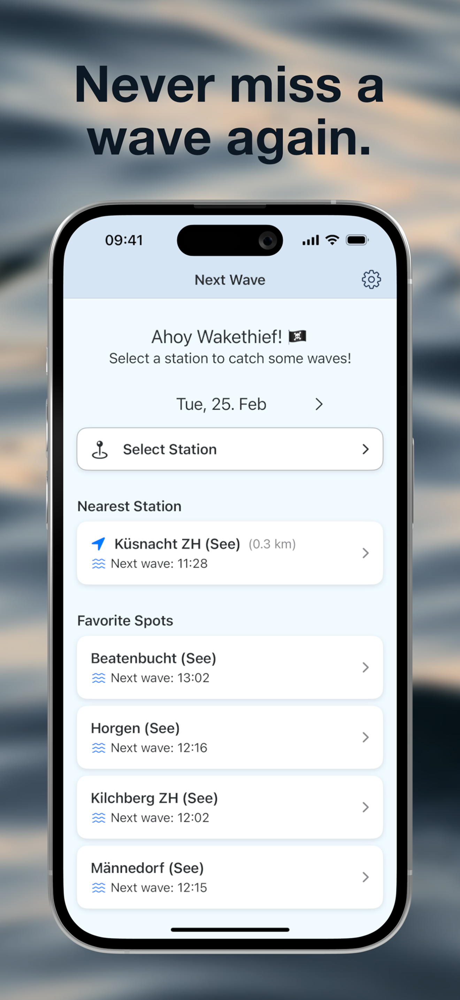

# Next Wave

Next Wave is an iOS app that helps wake surfers and foilers catch their perfect wave on Lake Zurich by providing real-time boat schedules and smart notifications.



## Features

- 🌊 Real-time boat schedule tracking
- 🔔 Smart notifications 3,5,10 or 15 minutes before waves
- 📍 Easy spot selection on Swiss lakes
- 🎯️ Interactive map with OpenStreetMap integration
- 🎯 Precise wave timing information
- 🔊 Custom sound notifications
- 🎨 Clean, intuitive interface
- 📱 Light & Dark Mode

## Technical Details

- Built with Swift and SwiftUI
- Uses MapKit for base map functionality
- OpenStreetMap and OpenSeaMap tile overlays
- CoreLocation for user positioning
- Minimum iOS Version: 17.0
- iPhone support (portrait mode)
- Local notifications using UserNotifications
- Custom sound assets
- Schedule data in JSON format

## Map Features

- OpenStreetMap integration for detailed water navigation
- Shipping routes overlay for better orientation
- Station clustering for better overview
- Automatic map caching for offline use
- Optimized for both light and dark mode

## Installation

1. Clone the repository
2. Open `Next Wave.xcodeproj` in Xcode
3. Build and run the project

## Privacy

- No tracking or analytics
- No personal data collection
- All data stays on device
- Location data is only used to show your position on the map and is never stored or shared
- Location access can be denied without losing core app functionality

## Location Permission

The app requests location access to:
- Show your position on the map
- Enable the location tracking button

You can use the app without granting location access. In this case:
- Your position won't be shown on the map
- The location tracking button will be disabled

## Support

For questions or issues, please create an issue in the repository.


## How to add a new lake or station

### Data Structure

The app uses a JSON schedule file with the following structure. Note that coordinates are required for map display:

```
{
    "lakes": [
        {
            "name": "Lake",
            "operators": [
                "Operator"
            ],
            "stations": [
                {
                    "name": "Station Name",
                    "uic_ref": "8503651",
                    "coordinates": {
                        "latitude": 47.218035,
                        "longitude": 8.776638
                    }
                },
                {
                    "name": "Station Name",
                    "uic_ref": "8503682",
                    "coordinates": {
                        "latitude": 47.218035,
                        "longitude": 8.776638
                    }
                }
            ]
        },
    ]
}
```

To find the name and especially the station ID, use the tool https://overpass-turbo.eu/
Search for the lake on the map on the right and make it completely visible. enter the following query in the console on the left:

```
node
  [amenity=ferry_terminal]
  ({{bbox}});
out;
```

All ship stations are displayed. Clicking on the station opens a window where you can find the station ID, the name of the station and the coordinates. uic_name and uic_ref. These values are entered in the JSON file.

You can check whether the station is available in the API via https://transport.opendata.ch/v1/locations?query=[uic_ref].
The link above is for Switzerland. For other countries, you have to find another api to find departure times.

## Feature Ideas Welcome

Have an idea for improving Next Wave? We're always open to suggestions from the community! Whether it's new features, usability improvements, or support for additional lakes - we'd love to hear from you. Feel free to open an issue on GitHub to discuss your ideas or contribute directly through a pull request.

Some ideas that have been suggested:
- Link to Foil Mates and vice versa for nearby spots

Note: International support is currently out of scope for this project. Feel free to fork the repository and create a version for your specific country!

## Maintainers

[@pfederi](https://github.com/pfederi).

## Contributing

Contributions are welcome! Please feel free to submit a Pull Request.
Kanban Board is here: https://github.com/users/pfederi/projects/1

## License

This project is licensed under the MIT License - see the LICENSE file for details.

## Contact

Join our community: [Pumpfoiling Community](https://pumpfoiling.community)

## Safety Notice

Always maintain a safe distance from boats and follow local water safety regulations. Never surf directly behind vessels.

## Acknowledgments

- Thanks to all beta testers
- Map data © OpenStreetMap contributors
- Special thanks to the Lake boat operators - We would be delighted if you step on the gas a little more while departing from the dock.
